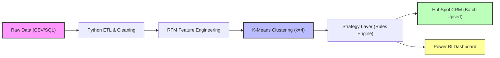

# The Olist Intelligence Bridge: End-to-End Customer Segmentation & CRM Automation 🚀


An enterprise-grade data engineering and data science pipeline that transforms raw e-commerce logs into actionable customer insights.  
This project moves beyond static analysis by implementing a **Closed-Loop Analytics System** — ingesting data, training an unsupervised ML model (K-Means), and automating the "Next Best Action" delivery directly to a CRM (HubSpot).

---

## 💼 Business Problem
E-commerce businesses often sit on millions of transaction rows but treat every customer identically.

* **The Pain Point:** High-value customers ("Platinum") receive the same generic newsletters as one-time buyers ("Silver").
* **The Solution:** An automated engine that segments customers based on behavior (Recency, Frequency, Monetary) and pushes personalized "Next Best Actions" to marketing teams in real time.

---

## 🏗️ Architecture

The system follows a **Split Architecture** design, separating the Operational Path (CRM Action) from the Analytical Path (Strategic Reporting).


## 🛠️ Tech Stack
Language: Python 3.9+ (pandas, numpy, requests, scikit-learn)

Database: PostgreSQL (Relational Data Warehouse)

Machine Learning: K-Means Clustering (Unsupervised Learning) + Log Transformation

Operational Tool: HubSpot CRM (API Batch Upsert)

Visualization: Matplotlib, Seaborn (EDA), Power BI (Dashboarding)

## ⚙️ Methodology & Workflow
1. Ingestion & Modeling (ETL)
The Olist E-Commerce Dataset consists of 9 relational tables.

Challenge: customer_id is unique per order, not per person.

Solution: Aggregated data by customer_unique_id to track true lifetime value.

Data Integrity: Filtered out ~3,000 "Ghost Orders" (Canceled/Unavailable) to prevent revenue inflation.

Enrichment: Merged Review scores (Sentiment) and Product Categories for context.

2. Feature Engineering (Python)
Implemented an RFM Analysis Model:

Recency: Days since last purchase (Dynamic reference date).

Frequency: Count of unique orders.

Monetary: Sum of price + freight.

Optimization: Applied np.log1p (Log Transformation) and StandardScaler to handle the "Long Tail" skew typical in retail data.

3. The "Brain": Strategy Matrix (ML + Logic)
The model assigns a Tier (Cluster) and a Next Best Action using priority-based rules:

| Priority  | Context        | Logic Applied         | Example Action                        |
|-----------|----------------|-----------------------|---------------------------------------|
| 1 (High)  | Sentiment      | review_score <= 2     | "Apology Email + Service Recovery"    |
| 2         | Platinum Tier  | category = Tech       | "VIP Pre-Order: New Gadgets"          |
| 3         | Gold Tier      | frequency = High      | "Retention: 10% Off Next Order"       |
| 4         | Silver Tier    | spend < threshold     | "Win-Back: We Miss You"               |

4. Operationalization (Reverse ETL)
To HubSpot: Implemented robust batch processing (100 records/batch) with retry logic to update customer properties via API without hitting rate limits.

To Power BI: Created a direct connection to the processed RFM table for executive dashboards.


## 📊 Key Results
The "One-and-Done" Problem: Discovered that 96% of customers purchase only once.

The "Platinum" Tier: Only ~3% of users are repeat high-value buyers, but they drive significant revenue.

Risk Detection: Identified 216 Platinum Customers with low sentiment scores (1-2 stars) who were at high risk of churning and flagged them for immediate human intervention.

## 🚀 How to Run

Prerequisites
Python 3.9+

HubSpot Developer Account (Private App Access Token)

Olist Dataset (placed in data/raw/)

Installation
Clone the Repo

git clone [https://github.com/Prajwal291002/olist-loyalty-engine.git](https://github.com/Prajwal291002/olist-loyalty-engine.git)
cd olist-rfm-segmentation-pipeline

Install Dependencies
pip install -r requirements.txt

Setup Environment Variables
Open src/hubspot_connector.py and add your Token (or use a .env file):
HUBSPOT_ACCESS_TOKEN = 'your_hubspot_token_here'

Run the Pipeline
Step 1: Data Cleaning & ETL
python src/data_loader.py
Output: Generates data/processed/clean_data.csv

Step 2: Sync to CRM
python src/hubspot_connector.py
Output: Batches 1000 contacts to HubSpot with "Next Best Action" tags.

## 📂 Repository Structure
```
olist-intelligence-bridge/
├── data/                   # Raw and Processed Data (GitIgnored)
│   ├── raw/                # Original Olist CSVs
│   └── processed/          # Clean RFM tables
├── notebooks/              
│   ├── 1.0_etl.ipynb       # Data Cleaning & Joining
│   ├── 2.0_rfm.ipynb       # Feature Engineering
│   └── 3.0_strategy.ipynb  # K-Means Model & Strategy Logic
├── src/
│   ├── data_loader.py      # Production ETL Script
│   └── hubspot_connector.py # API Batch Upsert Script
├── requirements.txt        # Dependencies
└── README.md               # Documentation
```