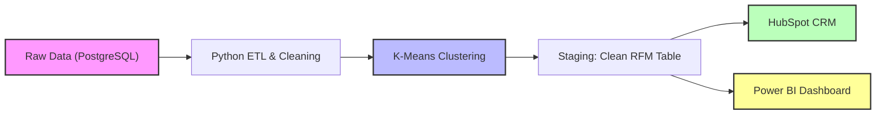

# olist-rfm-segmentation-pipeline
The Olist Intelligence Bridge: End-to-End Customer Segmentation &amp; CRM Automation

# The Olist Intelligence Bridge: End-to-End Customer Segmentation & CRM Automation 🚀

An enterprise-grade data engineering and data science pipeline that transforms raw e-commerce logs into actionable customer insights.  
This project moves beyond static analysis by implementing a **Closed-Loop Analytics System** — ingesting data, training an unsupervised ML model (K-Means), and automating the "Next Best Action" delivery directly to a CRM (HubSpot).

---

## 🏗️ Architecture

The system follows a **Split Architecture** design, separating the Operational Path (CRM Action) from the Analytical Path (Strategic Reporting).

💼 Business Problem
E-commerce businesses often sit on millions of transaction rows but treat every customer identically.

The Pain Point: High-value customers ("Platinum") receive the same generic newsletters as one-time buyers ("Silver").
The Solution: An automated engine that segments customers based on behavior (Recency, Frequency, Monetary) and pushes personalized "Next Best Actions" to marketing teams in real time.

🛠️ Tech Stack
Language: Python 3.9+ (pandas, scikit-learn, sqlalchemy, hubspot-api-client)

Database: PostgreSQL (Relational Data Warehouse)

Machine Learning: K-Means Clustering (Unsupervised Learning)

Operational Tool: HubSpot CRM (Free Tier)

Visualization: Power BI (Desktop)
⚙️ Methodology & Workflow
1. Ingestion & Modeling (SQL)
The Olist E-Commerce Dataset consists of 9 relational tables.

Challenge: customer_id is unique per order, not per person.

Solution: Aggregated data by customer_unique_id to track true lifetime value.

Data Integrity: Filtered out Canceled and Unavailable orders to prevent revenue inflation.

Geo-Spatial: Grouped zip_code_prefix to handle many-to-one coordinate mapping.

2. Feature Engineering (Python)
Implemented an RFM Analysis Model:

Recency: Days since last purchase (reference date = max(date) + 1).

Frequency: Count of unique orders.

Monetary: Sum of price + freight.

Optimization: Applied Log Transformation and StandardScaler to handle skew typical in retail data.

3. The "Brain": Strategy Matrix (ML + Logic)
The model assigns a Tier (Cluster) and a Next Best Action using priority-based rules:
| Priority | Context       | Logic Applied     | Example Action                    |
| -------- | ------------- | ----------------- | --------------------------------- |
| 1 (High) | Sentiment     | review_score <= 2 | Apology Email + Service Recovery  |
| 2        | Platinum Tier | category = Tech   | VIP Pre-Order: New Arrivals       |
| 3        | Gold Tier     | frequency = High  | Referral Bonus: Give $20, Get $20 |
| 4        | Silver Tier   | spend < threshold | Free Shipping Nudge               |

4. Operationalization (Reverse ETL)
To HubSpot: Implemented batch processing (100 records/batch) to update customer properties (Loyalty_Tier, Next_Action) via API without hitting rate limits.

To Power BI: Created a direct connection to analytics.customer_rfm_table in PostgreSQL for executive dashboards.

🚀 How to Run
Prerequisites
PostgreSQL installed locally

HubSpot Developer Account (API Key/Access Token)

Python 3.9+

Installation
Clone the Repo
git clone https://github.com/Prajwal291002/olist-rfm-segmentation-pipeline.git
cd olist-rfm-segmentation-pipeline

Install Dependencies
pip install -r requirements.txt

Setup Environment Variables
Create a .env file in the root directory:
DB_HOST=localhost
DB_NAME=olist_db
DB_USER=postgres
DB_PASS=your_password
HUBSPOT_ACCESS_TOKEN=your_hubspot_token

Run the Pipeline

# Step 1: Initialize DB and Load Data
python src/db_ingest.py

# Step 2: Run Analysis & Update CRM
python src/main_pipeline.py

📊 Repository Structure

olist-intelligence-bridge/
├── data/                   # Raw CSV files (Olist Dataset)
├── sql/
│   ├── schema_setup.sql    # Create table scripts
│   └── views.sql           # Aggregation queries
├── src/
│   ├── db_connector.py     # PostgreSQL connection logic
│   ├── rfm_engine.py       # Feature Engineering & K-Means
│   ├── strategy_logic.py   # The "Next Best Action" rules
│   └── hubspot_sync.py     # Batch API upload script
├── notebooks/              # Jupyter notebooks for EDA & Elbow Method
├── requirements.txt
├── .env
└── README.md

📈 Results
Segmentation: Identified 3 distinct customer personas (Platinum, Gold, Silver).

Automation: Reduced manual segmentation time from hours to seconds.

Actionability: Marketing teams now receive "ready-to-send" campaign data directly in their CRM tool.

Author: 
License:

***

Would you like me to adjust the badges or color scheme (for example, custom icons or GitHub-style dark theme)?

